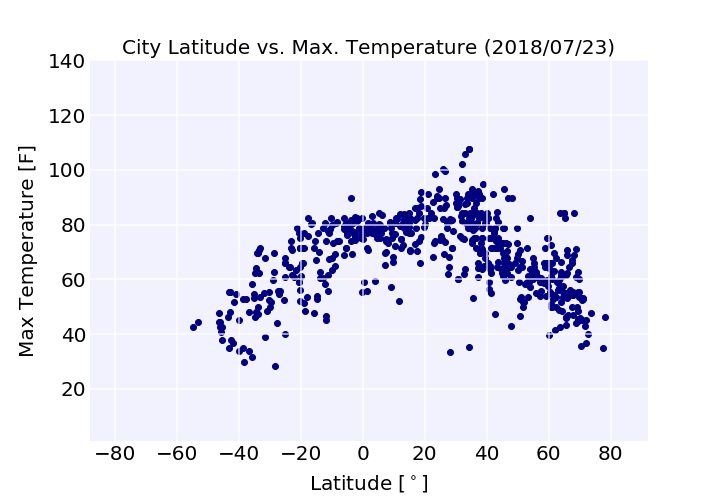
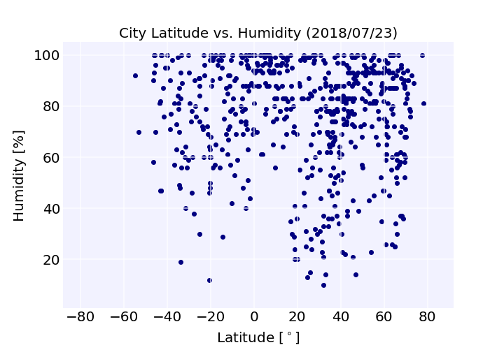
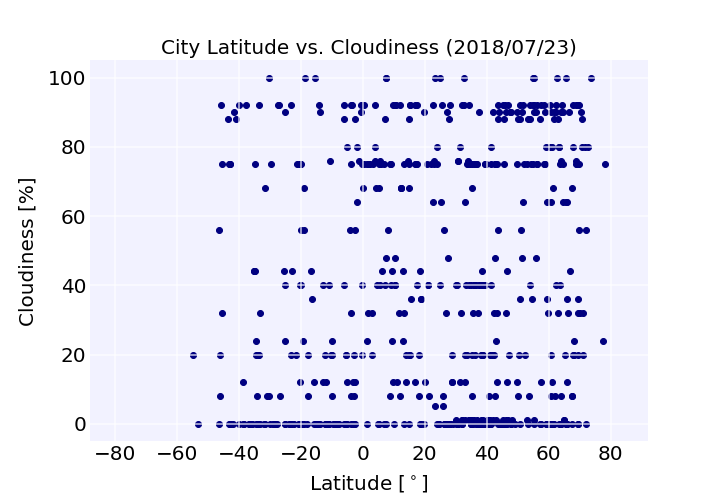
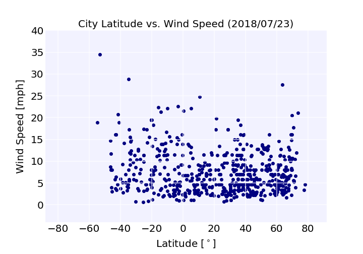

# python-api-weather
A project using Python to visualize the weather in cities across latitudes; part of the USC Data Analytics Bootcamp. We carry out our analysis using Pandas, matplotlib, and the OpenWeatherMap API.

## Results:

* From the temperature scatter plot we indeed see that the temperatures are highest at low latitudes (near the equator). We of course see excursions at moderate latitudes on the Northern hemisphere because of summer there and lower temperatures at moderate latitudes on the Southern hemisphere because of winter there.

* Further, in the temperature scatter plot there are a number of outliers with unusually low temperatures on the Northern hemisphere at low latitudes. An inspection of these points shows that they are in mountainous regions. Obviously, it's cold in the mountains even in summer.

* The humidity plot shows that it varies wildly with latitude without a clear trend. This plot also lets us realize that there are more cities in our sample from in the Northern hemisphere. There's a lot of water and uninhabited regions in the Southern hemisphere, so this is not too surprising.

* Similar to humidity, there is no clear trend with the cloudiness data. One would expect humidity and cloudiness somewhat correlated. This could be analyzed further.

* The wind speed plot reveals that there are very high winds in polar regions (high latitudes) today. Otherwise wind speed doesn't appear to have a strong dependence on latitude.

* Overall, we note that this data sample is from a single day only. In order to get a more meaningful view of latitudinal variation of weather, it'd be good to look at averages over many days or even weeks. Much longer periods might not be meaningful though because of seasonal variations.

